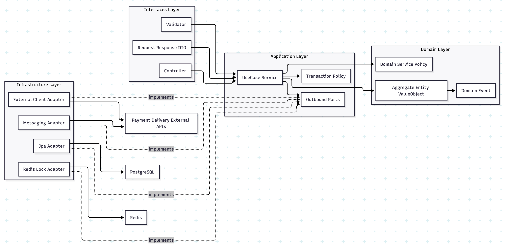
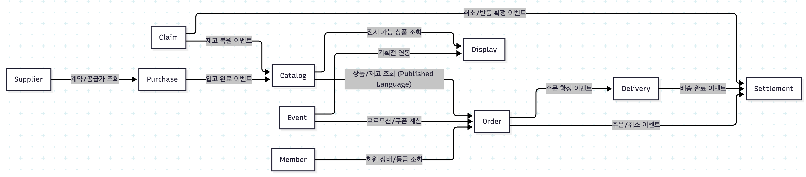
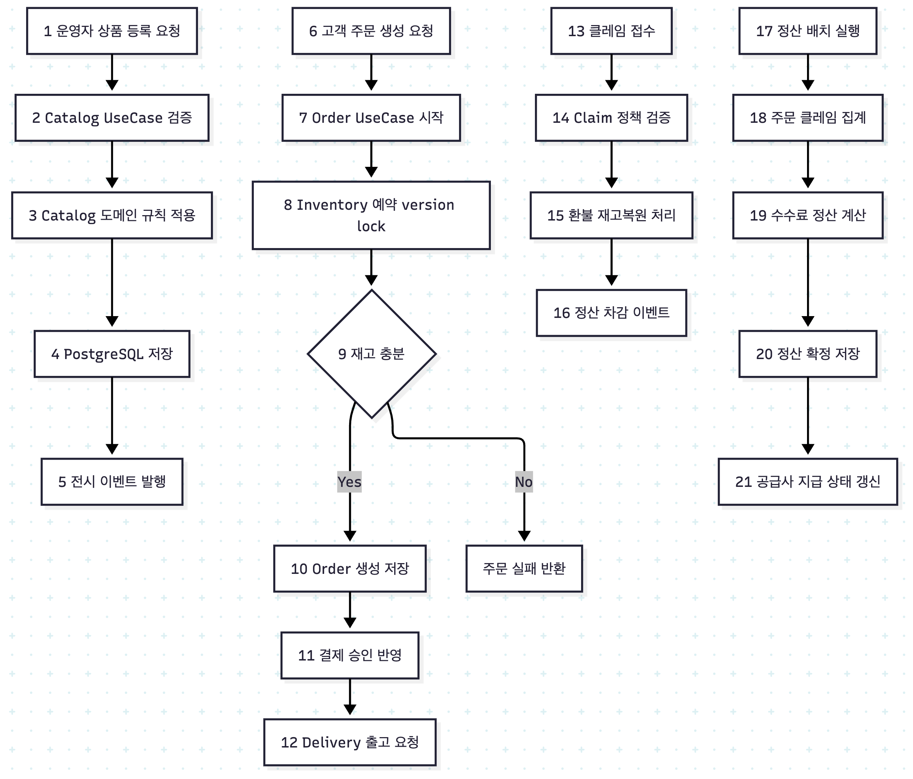
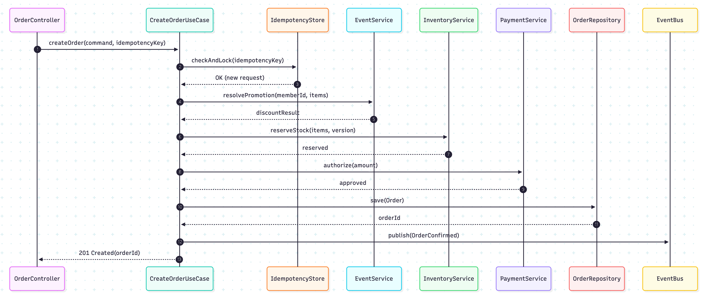
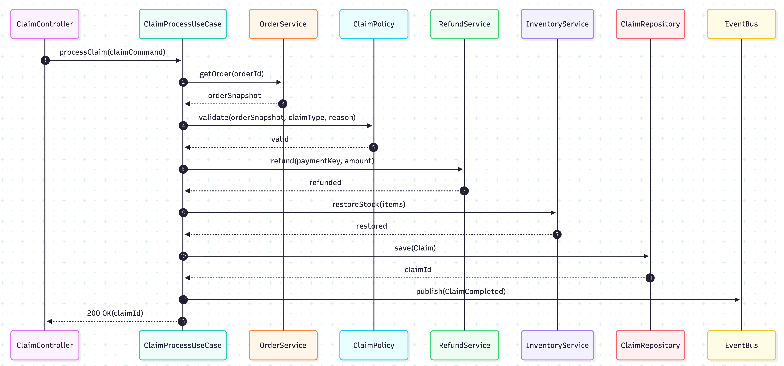
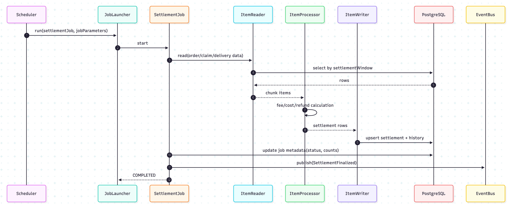

# Food Commerce Backoffice (Learning Project)

## 1. 프로젝트 개요
- 기간: 2026-02-16 ~ 2026-05-16 (3개월)
- 목표: 식품 이커머스 백오피스 도메인을 직접 설계/구현하며 백엔드 핵심 역량(도메인 모델링, 트랜잭션, 동시성, 성능, 안정성)을 학습한다.
- 범위: Front는 최소 React 화면이 준비되었다고 가정하고, Backend API 중심으로 진행한다.

## 2. 주요 기능
- 상품 관리: 상품, 카테고리, 가격, 재고, 유통기한 관리
- 전시 관리: 배너, 기획전, 노출 순서, 전시 기간 관리
- 이벤트 관리: 쿠폰, 프로모션, 할인 정책, 적용 조건 관리
- 회원 관리: 회원 정보, 등급, 권한, 휴면 상태 관리
- 공급사 관리: 공급사 정보, 계약, 공급가 정책 관리
- 주문 관리: 주문 생성, 결제 결과 반영, 주문 상태 전이
- 클레임 관리: 취소, 반품, 교환 접수/처리
- 배송 관리: 출고, 송장, 배송 상태 추적
- 발주 관리: 발주 생성, 입고 처리, 재고 반영
- 정산 관리: 주문/클레임 기준 정산 금액 계산 및 지급 상태 관리
- 감사 로그: 주요 상태 변경 이력, 운영자 액션 추적

## 3. 기술 스택
- Backend: Java 21, Spring Boot, Spring Data JPA, Spring Validation
- Auth/Security: Spring Security, JWT (Access/Refresh Token), RBAC
- Database: PostgreSQL
- Cache/Lock: Redis (분산락/캐시 필요 구간에 한정 적용)
- Messaging: AWS SQS/SNS 또는 LocalStack 기반 이벤트 실험
- Frontend: React (최소 화면, API 연동 중심)
- Batch: Spring Batch
- Infra: AWS EC2 (프리티어 우선) 또는 Local Docker + LocalStack
- CI/CD: AWS CodePipeline, AWS CodeBuild, AWS CodeDeploy
- Pipeline Source: GitHub (CodeStarSourceConnection, webhook/event 기반 트리거)
- Artifact/Image: Amazon ECR
- Test: JUnit5, Mockito, Testcontainers (PostgreSQL)

## 4. 아키텍처(Backend)
- 아키텍처 선택: `Layered + Hexagonal 규칙`의 하이브리드
- 이유: 학습 초반 생산성은 레이어드로 확보하고, 의존성 역전과 도메인 순수성은 헥사고날 원칙으로 강제한다.
- 스타일: DDD 기반 모듈형 모놀리스

### 레이어 구성
- interfaces (Inbound Adapter): Controller, Request/Response DTO, Validation
- application (Use Case): 유스케이스, 트랜잭션 경계, 인가 체크, Port 인터페이스
- domain (Core): Entity, Value Object, Domain Service, Domain Event
- infrastructure (Outbound Adapter): JPA/Redis/외부 API/메시징 구현체

### 의존성 규칙(DIP)
- interfaces -> application -> domain
- infrastructure -> application/domain의 Port 구현
- domain은 Spring, JPA, AWS SDK 등 프레임워크/인프라에 의존하지 않는다.

### 아키텍처 다이어그램 (레이어 의존성)

### 컨텍스트 맵

### Bounded Context
| Context | Domain Type | 핵심 책임 | 대표 Aggregate | 소유 데이터 |
| --- | --- | --- | --- | --- |
| Catalog | Core | 상품/가격/재고/유통기한 관리 | Product, Stock | 상품, 재고, 가격 |
| Order | Core | 주문 생성/상태 전이/결제 반영 | Order, OrderLine | 주문, 주문상태 |
| Claim | Core | 취소/반품/교환 및 환불 처리 | Claim, Refund | 클레임, 환불결과 |
| Settlement | Core | 주문/클레임/배송 기준 정산 계산 | Settlement, Payout | 정산원장, 지급상태 |
| Delivery | Supporting | 출고/배송상태/송장 관리 | Shipment, Tracking | 배송상태, 송장 |
| Purchase | Supporting | 발주/입고 처리 | PurchaseOrder, GoodsReceipt | 발주, 입고 |
| Supplier | Supporting | 공급사/계약/공급가 정책 | Supplier, Contract | 공급사, 계약 |
| Event | Supporting | 쿠폰/프로모션/혜택 규칙 | Promotion, Coupon | 이벤트, 쿠폰 |
| Display | Supporting | 전시/배너/기획전 노출 | Exhibition, Banner | 전시구성, 배너 |
| Member | Generic | 회원 기본정보/등급/상태 | Member, MemberGrade | 회원, 등급 |

 

### 컨텍스트 경계 규칙
- 각 컨텍스트는 **자기 DB 테이블만 직접 수정**한다.
- 컨텍스트 간 동기 호출은 **조회 중심**으로 제한한다.
- 상태 변경 전파는 도메인 이벤트(비동기)를 기본으로 한다.
- 타 컨텍스트 엔티티 참조 금지, **ID + 스냅샷**만 사용한다.
- 외부 연동/타 컨텍스트 의존은 `application port` + `infrastructure adapter`로 캡슐화한다.

### 트랜잭션/동시성 원칙
- 애그리거트 단위 트랜잭션 경계 유지
- 재고/수량 변경은 낙관적 락(version) 기본 적용
- 고경합 구간은 비관적 락 또는 Redis 분산락을 제한적으로 적용
- 멱등성 키(idempotency key)로 중복 요청 방지

### 인증/인가 원칙
- 인증 방식은 JWT 기반(Access Token + Refresh Token)으로 운영한다.
- 백오피스 API는 Spring Security Filter에서 JWT 검증 후 접근한다.
- 운영자 권한은 RBAC(Role 기반 인가)로 분리한다. (ADMIN, MD, CS, SETTLEMENT)
- 민감 API(주문 상태 수동 변경, 정산 확정, 클레임 승인)는 권한별 접근을 강제한다.

## 5. 데이터 플로우
1. 운영자가 로그인하고 JWT Access Token/Refresh Token을 발급받는다.
2. 운영자(MD)가 JWT Access Token으로 상품/가격/전시 정보를 등록한다.
3. 고객 주문 생성 시 주문 항목 기준 재고 예약을 수행한다.
4. 결제 결과를 반영해 주문 상태를 확정한다.
5. 출고 지시 후 배송 상태를 갱신한다.
6. 취소/반품/교환 발생 시 클레임 정책에 따라 환불/재고 복원/재정산을 처리한다.
7. 정산 배치에서 주문/클레임/수수료를 집계해 공급사 정산 금액을 확정한다.
8. 모든 상태 변경 이벤트는 감사 로그와 이력 테이블에 기록한다.

### 데이터 플로우 다이어그램

### 핵심 시퀀스
1. 주문 생성 시퀀스

 

2. 클레임 처리 시퀀스

 
 

3. 정산 배치 시퀀스

## 6. CI/CD 파이프라인
1. GitHub push (main 또는 지정 브랜치)
2. GitHub webhook/event로 CodePipeline 자동 트리거
3. CodeBuild에서 빌드/테스트
4. Docker 이미지 빌드 후 ECR 푸시 (도커 전략 사용 시)
5. CodeDeploy로 EC2 배포

## 7. 완료 기준 (Definition of Done)
- 핵심 API에 단위/통합 테스트가 존재한다.
- 주문/재고/클레임/정산 도메인 규칙을 코드와 문서로 설명할 수 있다.
- 동시성/성능/예외 처리 관점의 리뷰 체크리스트를 통과한다.

## 8. 로드맵

## 1개월차 (기초 설계 + 핵심 도메인)
### 1주차
- 프로젝트 멀티모듈 구조 세팅
- 공통 예외/응답 포맷/로깅 규격 정의
- PostgreSQL 스키마 초안 및 마이그레이션 환경 구성
- catalog/member/order 도메인 모델 초안 작성

### 2주차
- 상품/회원 API 구현 (CRUD + 기본 검증)
- 주문 생성 API 구현 (주문 상태 모델 포함)
- JWT 로그인/재발급(Access/Refresh) API 구현
- 단위/통합 테스트 템플릿 구축

### 3주차
- 재고 예약/차감 로직 구현
- 낙관적 락 기반 동시성 제어 1차 적용
- 주문 생성 시나리오 통합 테스트 작성

### 4주차
- 주문 취소(결제 전/후 분기) 구현
- N+1 점검 및 조회 성능 개선
- 1개월차 회고: 모델/트랜잭션 경계 재정의

## 2개월차 (운영 도메인 확장)
### 1주차
- display/event 컨텍스트 구현
- 전시 기간/이벤트 적용 조건 규칙 반영

### 2주차
- delivery 컨텍스트 구현
- 출고/송장/배송 상태 전이 API 구현

### 3주차
- claim 컨텍스트 구현
- 취소/반품/교환 처리 플로우 및 환불 연계

### 4주차
- supplier/purchase 컨텍스트 구현
- 발주 생성/입고 처리/재고 반영
- 운영자 권한(RBAC) 1차 적용 및 JWT 권한 클레임 연동

## 3개월차 (정산 + 품질 고도화)
### 1주차
- settlement 컨텍스트 구현
- 주문/클레임 기반 정산 계산 로직 구현

### 2주차
- 정산 배치/집계 API 구현
- 정산 이력/지급 상태 관리

### 3주차
- 보안 강화(입력 검증, 민감정보 마스킹, 권한 세분화)
- 장애 대응(재시도/타임아웃/예외 정책) 정리

### 4주차
- 성능 점검(슬로우 쿼리, 락 경합, 병목 분석)
- 문서화(ADR, 트러블슈팅, 운영 가이드)
- 최종 데모 및 학습 회고
